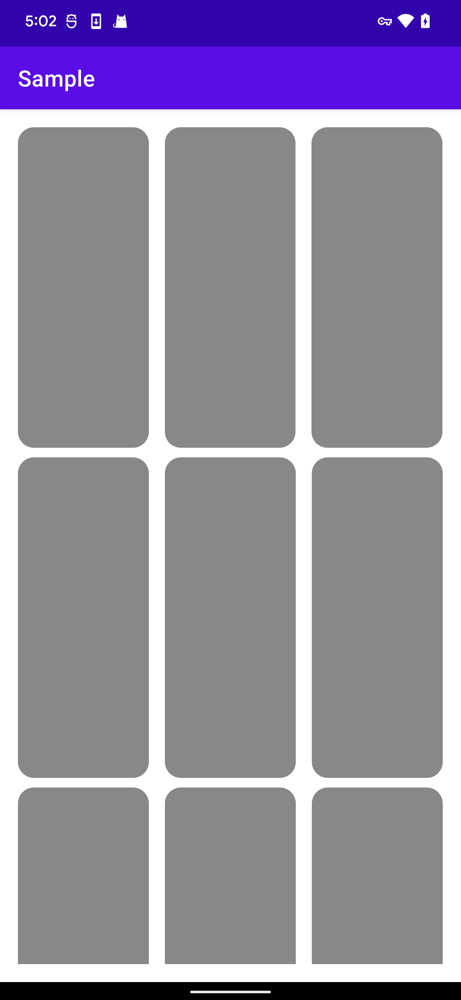

# SpaceItemDecoration

RecyclerView内部Items等分间距装饰类

支持：

> LinearLayoutManager

> GridLayoutManager

> 在StaggeredGridLayoutManager下，当列表发生变化时，在ItemDecoration中无法准确获得Item的SpanIndex，所以无法完美支持StaggeredGridLayoutManager，如果列表不会动态修改则可以正常使用

```groovy
implementation 'com.dreamgyf.android.ui:SpaceItemDecoration:1.0'
```

